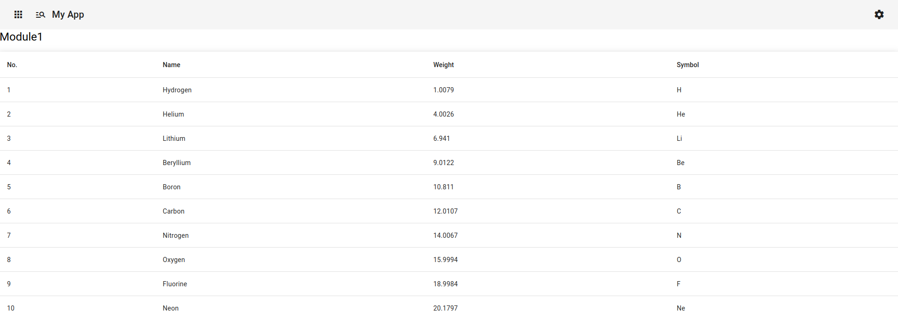

This is a simple example frontend written in [Typescript](https://www.typescriptlang.org/) using [Angular](https://angular.io/) in combination with the [Angular Material UI](https://material.angular.io/).

Compared to the standard Angular application generator it includes Angular Material UI with some sensible default settings and makes the icons/fonts available directly in the application without the need to fetch them everytime from Google.

The idea is that you simply can take this example and quickly write your application without the need to spend a lot of time on setting it initially up.

Note: Make sure that you have in your path the latest Node.js LTS version available.

You can try out the app on [CodeSandbox](https://codesandbox.io/) and play live with the code: https://codesandbox.io/p/github/ZuInnoTe/typescript-angular-example/

This is how the demo app looks like in the browser:

You see on the top a menu bar with 3 buttons:

- On the left a "Module 1" button for Module 1 showing an Angular Material table
- Next to it a "Module 2" button for Module 2 showing an advanced Angular Material form
- On the right a setting button not doing anything

## Code

The code is available under:

- Codeberg (a non-commercial European hosted Git for Open Source): https://codeberg.org/ZuInnoTe/typescript-angular-example
- Github (an US hosted commercial Git platform): https://github.com/ZuInnoTe/typescript-angular-example

## License

You can choose to either use [EUPL-1.2](./LICENSE-EUPL-1.2) ([Web](https://spdx.org/licenses/EUPL-1.2.html)) or [Apache-2.0](./LICENSE-Apache-2.0) ([Web](https://spdx.org/licenses/Apache-2.0.html)) license.

# Build

## Development server

Run `ng serve` for a dev server. Navigate to `http://localhost:4200/`. The application will automatically reload if you change any of the source files.

## Code scaffolding

Run `ng generate component component-name` to generate a new component. You can also use `ng generate directive|pipe|service|class|guard|interface|enum|module`.

## Build

Run `ng build` to build the project. The build artifacts will be stored in the `dist/` directory.

## Running unit tests

Run `ng test` to execute the unit tests via [Karma](https://karma-runner.github.io).

## Running end-to-end tests

Run `ng e2e` to execute the end-to-end tests via a platform of your choice. To use this command, you need to first add a package that implements end-to-end testing capabilities.

## Further help

To get more help on the Angular CLI use `ng help` or go check out the [Angular CLI Overview and Command Reference](https://angular.io/cli) page.
